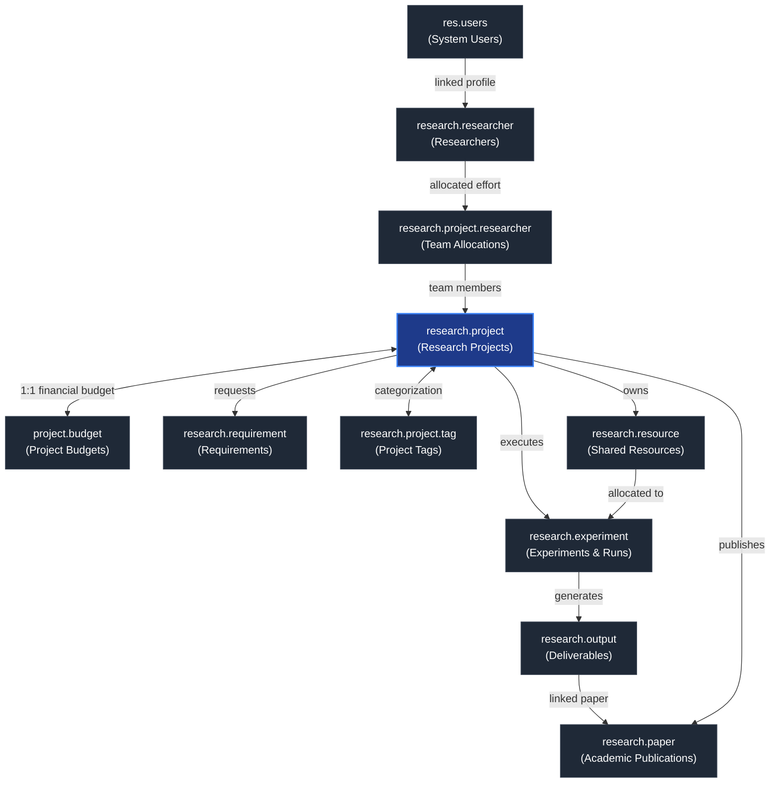

# Research-Supply-Chain

[](https://www.odoo.com/)
[](file:///d:/Center/Github_Profile/Research-Supply-Chain/LICENSE)
[](https://www.python.org/)

An enterprise-grade **Odoo 19** module designed for managing the full operational lifecycle of scientific research projects, team member allocations, material & computational requirements, shared physical resources, experimental runs, project budgets, deliverables, and academic publication tracking.

---

## Documentation Suite

Comprehensive technical documentation is maintained in the **[`docs/`](file:///d:/Center/Github_Profile/Research-Supply-Chain/docs/)** directory:

- **[Documentation Index](file:///d:/Center/Github_Profile/Research-Supply-Chain/docs/INDEX.md)** — Main documentation hub & executive system overview.
- **[Architecture & System Design](file:///d:/Center/Github_Profile/Research-Supply-Chain/docs/ARCHITECTURE.md)** — Core system layers, Mermaid ER diagram, security rules, and design patterns.
- **[Data Models Specification](file:///d:/Center/Github_Profile/Research-Supply-Chain/docs/DATA_MODELS.md)** — Exhaustive field-by-field reference for all custom Odoo models, constraints, and mixins.
- **[Advanced Python Concepts Guide](file:///d:/Center/Github_Profile/Research-Supply-Chain/docs/PYTHON_CONCEPTS_GUIDE.md)** — Hands-on guide covering OOP mixins, decorators, regex validation, generators, itertools, and error handling.
- **[API Specification & Reference](file:///d:/Center/Github_Profile/Research-Supply-Chain/docs/API_DOCUMENTATION.md)** — REST & JSON-RPC API endpoints, input sanitization rules, and response payloads.
- **[Postman API Testing Guide](file:///d:/Center/Github_Profile/Research-Supply-Chain/docs/POSTMAN_API_GUIDE.md)** — Postman collection setup, cookie authentication, and test runner guide.
- **[Testing & Synthetic Data Guide](file:///d:/Center/Github_Profile/Research-Supply-Chain/docs/TESTING_AND_DATA_GENERATION.md)** — Automated test suite execution, Python generator script, and UI Wizard manual.
- **[Getting Started & Operations](file:///d:/Center/Github_Profile/Research-Supply-Chain/docs/GETTING_STARTED.md)** — Installation, environment setup, deployment workflows, and troubleshooting.

---

## Architecture Overview

The `research_supply_chain` module implements an end-to-end relational model for scientific workflow orchestration:



---

## Core Models Catalog

| Technical Model Name | Description | Key Fields & Relationships |
|---|---|---|
| [`research.project`](file:///d:/Center/Github_Profile/Research-Supply-Chain/docs/DATA_MODELS.md#2-researchproject-research-project) | Primary project business unit | `code`, `project_name`, `lead_researcher_id`, `visibility`, `tag_ids`, `start_date`, `end_date`, `project_status`, `budget_ids` |
| [`research.researcher`](file:///d:/Center/Github_Profile/Research-Supply-Chain/docs/DATA_MODELS.md#1-researchresearcher-researcher) | Researcher profile | `user_id`, `position`, `expertise`, `is_principal`, `project_line_ids` |
| [`research.project.researcher`](file:///d:/Center/Github_Profile/Research-Supply-Chain/docs/DATA_MODELS.md#3-researchprojectresearcher-project-team-allocation) | Team allocation line | `project_id`, `researcher_id`, `role`, `allocated_pct`, `join_date` |
| [`project.budget`](file:///d:/Center/Github_Profile/Research-Supply-Chain/docs/DATA_MODELS.md#4-projectbudget-project-budget) | Financial budget record | `project_id`, `currency_id`, `total_amount`, `spent_amount`, `remaining_amount` |
| [`research.requirement`](file:///d:/Center/Github_Profile/Research-Supply-Chain/docs/DATA_MODELS.md#5-researchrequirement-research-requirement) | Material/compute request | `project_id`, `category`, `name`, `quantity`, `priority`, `status`, `needed_by` |
| [`research.resource`](file:///d:/Center/Github_Profile/Research-Supply-Chain/docs/DATA_MODELS.md#6-researchresource-research-resource) | Physical hardware / compute resource | `name`, `resource_type`, `specification`, `availability_status`, `owner_project_id` |
| [`research.experiment`](file:///d:/Center/Github_Profile/Research-Supply-Chain/docs/DATA_MODELS.md#7-researchexperiment-research-experiment) | Experimental run | `project_id`, `name`, `owner_id`, `objective`, `methodology`, `status`, `experiment_resource_ids`, `output_ids` |
| [`research.experiment.resource`](file:///d:/Center/Github_Profile/Research-Supply-Chain/docs/DATA_MODELS.md#8-researchexperimentresource-experiment-resource-allocation) | Junction resource allocation | `experiment_id`, `resource_id`, `purpose`, `quantity` |
| [`research.output`](file:///d:/Center/Github_Profile/Research-Supply-Chain/docs/DATA_MODELS.md#9-researchoutput-research-output) | Technical output / deliverable | `experiment_id`, `project_id`, `output_type`, `name`, `status` |
| [`research.paper`](file:///d:/Center/Github_Profile/Research-Supply-Chain/docs/DATA_MODELS.md#10-researchpaper-research-paper) | Academic publication | `paper_name`, `paper_author`, `paper_doi`, `paper_status`, `paper_github_url`, `project_id`, `output_id` |
| [`research.project.tag`](file:///d:/Center/Github_Profile/Research-Supply-Chain/docs/DATA_MODELS.md#11-researchprojecttag-research-project-tag) | Categorization tags | `name`, `color` |

---

## REST API & Controller Endpoints

The module includes JSON-RPC HTTP controllers in [`controllers/main.py`](file:///d:/Center/Github_Profile/Research-Supply-Chain/addons/research_supply_chain/controllers/main.py) with built-in input sanitization:

| HTTP Method | Route Endpoint | Auth | Description |
|---|---|---|---|
| `POST` | `/api/v1/projects` | User | Fetch filtered project list with pagination. |
| `POST` | `/api/v1/project/create` | User | Create a new research project safely. |
| `POST` | `/api/v1/researchers` | User | Fetch active researchers directory (privacy-scoped). |
| `POST` | `/api/v1/experiments` | User | Fetch experiments grouped by execution status. |
| `POST` | `/api/v1/papers` | User | Fetch internal publications catalog. |
| `POST`/`GET` | `/api/v1/papers/public` | Public | External public access for published research citations. |

---

## Quick Start & Installation

### 1. Module Setup
Place the addon directory inside your Odoo `addons_path`:
```bash
./odoo-bin -c odoo.conf -d research_db -i research_supply_chain
```

### 2. Demo Data Loading
Initialize sample dataset during database creation:
```bash
./odoo-bin -c odoo.conf -d research_demo_db --dev=all
```

---

## Testing & Verification

Run the automated test suite directly using the standard Odoo testing runner:
```bash
./odoo-bin -c odoo.conf -d research_test_db --test-enable --test-tags=research_supply_chain
```

---

## License
Distributed under the **MIT License**. See [`LICENSE`](file:///d:/Center/Github_Profile/Research-Supply-Chain/LICENSE) for details.
