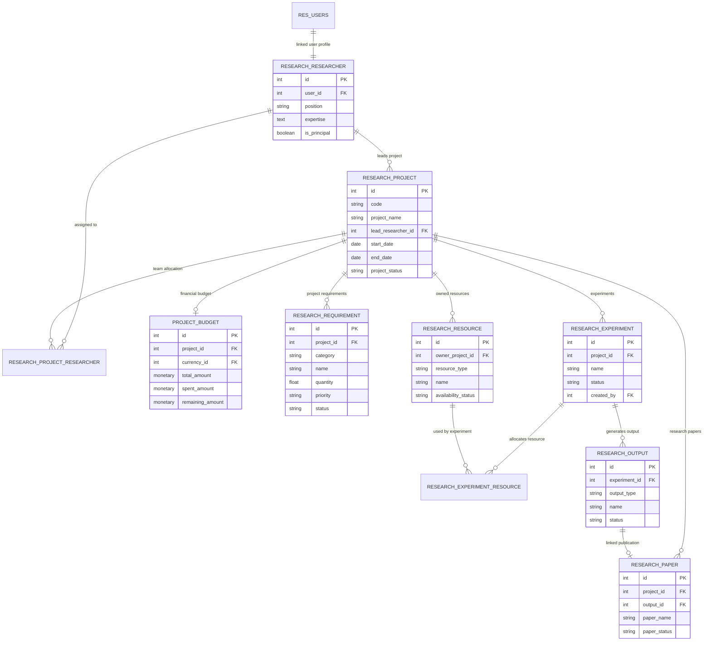

# Architecture & System Design

This document details the architectural foundation, entity relationships, security controls, and design patterns of the **Research Supply Chain** module.

---

## 🏛️ System Architecture Layers

The module follows Odoo's standard Model-View-Controller (MVC) architecture, extending the framework through cleanly isolated domain layers:

```
+-------------------------------------------------------------------+
|                        Web Presentation Layer                     |
|  (Kanban Views, Form Views, List Views, Search Filters, Menus)    |
+-------------------------------------------------------------------+
                                  |
                                  v
+-------------------------------------------------------------------+
|                       Business Logic & Domain Layer               |
|   (Python ORM Models, Business Constraints, Computed Fields)      |
+-------------------------------------------------------------------+
                                  |
                                  v
+-------------------------------------------------------------------+
|                    Security & Access Control Layer                |
|       (IR Access Rights CSV, Group Rules, Record-Level Rules)     |
+-------------------------------------------------------------------+
                                  |
                                  v
+-------------------------------------------------------------------+
|                       Persistence Layer                           |
|               (PostgreSQL Relational Storage Engine)              |
+-------------------------------------------------------------------+
```

---

## 🗂️ Entity-Relationship (ER) Diagram

The diagram below maps all custom models, foreign key relationships, and cardinalities within the module.



---

## 🔒 Security & Access Control Model

The security model is defined across two files:

1. **`security/research_security.xml`**: Defines security categories and user groups.
2. **`security/ir.model.access.csv`**: Defines CRUD access permissions per group across all custom models.

### Access Permissions Table

| Model ID | Model Name | Read | Write | Create | Delete |
| :--- | :--- | :---: | :---: | :---: | :---: |
| `model_research_researcher` | Researcher Profile | ✅ | ✅ | ✅ | ✅ |
| `model_research_project` | Research Project | ✅ | ✅ | ✅ | ✅ |
| `model_research_project_researcher` | Team Allocation | ✅ | ✅ | ✅ | ✅ |
| `model_project_budget` | Project Budget | ✅ | ✅ | ✅ | ✅ |
| `model_research_requirement` | Requirement | ✅ | ✅ | ✅ | ✅ |
| `model_research_resource` | Resource | ✅ | ✅ | ✅ | ✅ |
| `model_research_experiment` | Experiment | ✅ | ✅ | ✅ | ✅ |
| `model_research_experiment_resource` | Experiment Resource | ✅ | ✅ | ✅ | ✅ |
| `model_research_output` | Research Output | ✅ | ✅ | ✅ | ✅ |
| `model_research_paper` | Research Paper | ✅ | ✅ | ✅ | ✅ |
| `model_research_sample_data_wizard` | Sample Data Wizard | ✅ | ✅ | ✅ | ✅ |

---

## 💡 Key Design & Integrity Patterns

1. **Automatic Code Generation (`ir.sequence`)**:
   Projects generate unique reference codes (e.g., `PRJ00001`) automatically via `@api.model_create_multi` hooks in [research_project.py](file:///d:/Center/Github_Profile/Research-Supply-Chain/addons/research_supply_chain/models/research_project.py).

2. **Computed Monetary Fields (`@api.depends`)**:
   `remaining_amount` in [project_budget.py](file:///d:/Center/Github_Profile/Research-Supply-Chain/addons/research_supply_chain/models/project_budget.py) is computed dynamically as `total_amount - spent_amount` and stored for optimal search performance.

3. **Strict Validation Constraints (`@api.constrains`)**:
   - `start_date <= end_date` validation across Projects, Budgets, Requirements, and Experiments.
   - Unique constraints ensuring 1 user account maps to 1 Researcher profile, 1 Project maps to 1 Budget record, and unique researcher team membership.
