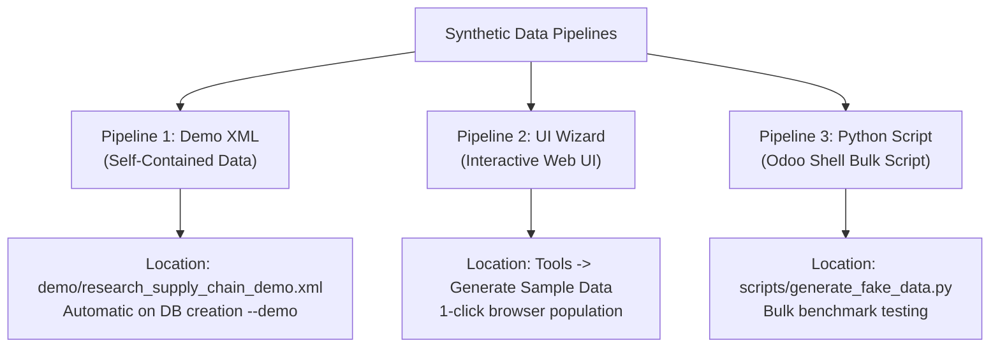

# Synthetic Data Generation & Automated Testing Guide

This guide explains how to execute automated test suites, run data generation pipelines, and perform database audits within the **Research Supply Chain** module.

---

## 1. Automated Test Suite Execution

The module includes an automated unit test suite located in [`addons/research_supply_chain/tests/`](file:///d:/Center/Github_Profile/Research-Supply-Chain/addons/research_supply_chain/tests/):

### Test Modules Catalog
- **[`test_research_project.py`](file:///d:/Center/Github_Profile/Research-Supply-Chain/addons/research_supply_chain/tests/test_research_project.py)** — Tests project creation, code generation, date constraints, and skills analysis set operations.
- **[`test_researcher.py`](file:///d:/Center/Github_Profile/Research-Supply-Chain/addons/research_supply_chain/tests/test_researcher.py)** — Tests user link constraints and researcher profile active states.
- **[`test_requirements.py`](file:///d:/Center/Github_Profile/Research-Supply-Chain/addons/research_supply_chain/tests/test_requirements.py)** — Tests requirement priority, category, and date validation constraints.
- **[`test_experiment.py`](file:///d:/Center/Github_Profile/Research-Supply-Chain/addons/research_supply_chain/tests/test_experiment.py)** — Tests experiment status transitions, objective validation, and resource allocations.
- **[`test_cron_jobs.py`](file:///d:/Center/Github_Profile/Research-Supply-Chain/addons/research_supply_chain/tests/test_cron_jobs.py)** — Tests scheduled automated project/experiment status updates.
- **[`test_dynamic_changes.py`](file:///d:/Center/Github_Profile/Research-Supply-Chain/addons/research_supply_chain/tests/test_dynamic_changes.py)** — Tests dynamic line creations, onchange handlers, and computed budget totals.
- **[`test_inverse_functions.py`](file:///d:/Center/Github_Profile/Research-Supply-Chain/addons/research_supply_chain/tests/test_inverse_functions.py)** — Tests inverse setters for budget amounts, experiment counts, and paper counts.

### Executing Automated Tests
Run tests using the standard Odoo test runner CLI:

```bash
./odoo-bin -c odoo.conf -d research_test_db --test-enable --test-tags=research_supply_chain --stop-after-init
```

---

## 2. Synthetic Data Pipelines

To evaluate views, stress-test search filters, verify database constraints, and demonstrate functionality, 3 complementary data generation pipelines are implemented:



---

## Pipeline 1: Native Self-Contained XML Data

- **File**: [`addons/research_supply_chain/demo/research_supply_chain_demo.xml`](file:///d:/Center/Github_Profile/Research-Supply-Chain/addons/research_supply_chain/demo/research_supply_chain_demo.xml)
- **Manifest Listing**: Included under `"demo"` in [`__manifest__.py`](file:///d:/Center/Github_Profile/Research-Supply-Chain/addons/research_supply_chain/__manifest__.py).

### How to Load
Run Odoo with demo data enabled:
```bash
./odoo-bin -c odoo.conf -d research_demo_db --dev=all
```

---

## Pipeline 2: Interactive UI Wizard ("Generate Sample Data")

- **Source Files**: [`models/sample_data_wizard.py`](file:///d:/Center/Github_Profile/Research-Supply-Chain/addons/research_supply_chain/models/sample_data_wizard.py) & [`views/sample_data_wizard_views.xml`](file:///d:/Center/Github_Profile/Research-Supply-Chain/addons/research_supply_chain/views/sample_data_wizard_views.xml)

### How to Use via Web Browser
1. Log into Odoo web interface.
2. Open **Research Supply Chain** module.
3. Click on **Tools** ➔ **Generate Sample Data**.
4. Set the desired number of **Projects** and **Researchers** to create.
5. Click **Generate Fake Data**.

---

## Pipeline 3: Bulk Odoo Shell Script

- **Script File**: [`scripts/generate_fake_data.py`](file:///d:/Center/Github_Profile/Research-Supply-Chain/scripts/generate_fake_data.py)

### How to Execute via Odoo Shell
For high-volume stress testing (e.g. creating 50 projects and 20 researchers):

```bash
./odoo-bin shell -c odoo.conf -d research_db < scripts/generate_fake_data.py
```

Or interactively inside the Python Odoo shell:
```python
>>> from scripts.generate_fake_data import generate_all_fake_data
>>> generate_all_fake_data(env, num_projects=20, num_researchers=10)
```

---

## 3. Verification & Database Audit Commands

Verify record counts directly in the Odoo shell:

```python
print("Projects:", env['research.project'].search_count([]))
print("Researchers:", env['research.researcher'].search_count([]))
print("Budgets:", env['project.budget'].search_count([]))
print("Experiments:", env['research.experiment'].search_count([]))
print("Papers:", env['research.paper'].search_count([]))
```
