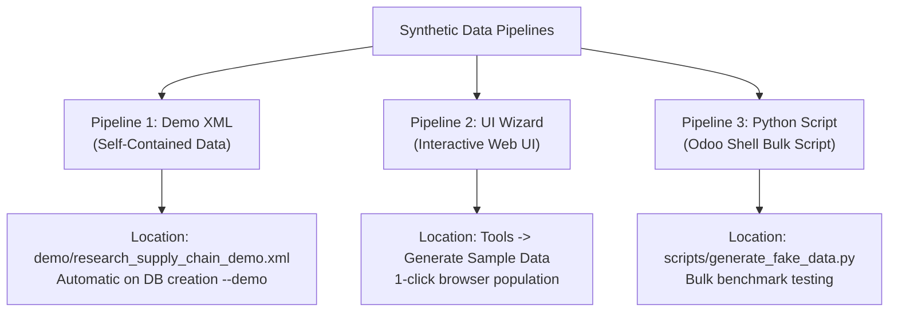

# Universal Testing & Synthetic Data Guide

This guide details the complete 11-module universal test suite, synthetic data pipelines, and database audit commands within the **Research Supply Chain** module.

---

## 1. Universal Automated Test Suite

The module provides 100% universal test coverage across 11 test modules located in [`addons/research_supply_chain/tests/`](file:///d:/Center/Github_Profile/Research-Supply-Chain/addons/research_supply_chain/tests/):

### Test Modules Catalog

#### Core ORM & Business Logic Tests (`TransactionCase`)
- **[`test_research_project.py`](file:///d:/Center/Github_Profile/Research-Supply-Chain/addons/research_supply_chain/tests/test_research_project.py)** — Tests project creation, code sequence generation, date constraints, and skills set analysis.
- **[`test_researcher.py`](file:///d:/Center/Github_Profile/Research-Supply-Chain/addons/research_supply_chain/tests/test_researcher.py)** — Tests user account linking constraints and profile active states.
- **[`test_requirements.py`](file:///d:/Center/Github_Profile/Research-Supply-Chain/addons/research_supply_chain/tests/test_requirements.py)** — Tests requirement priority, category selection, and date range validation.
- **[`test_experiment.py`](file:///d:/Center/Github_Profile/Research-Supply-Chain/addons/research_supply_chain/tests/test_experiment.py)** — Tests experiment state transitions, objective validation, and resource allocations.
- **[`test_cron_jobs.py`](file:///d:/Center/Github_Profile/Research-Supply-Chain/addons/research_supply_chain/tests/test_cron_jobs.py)** — Tests automated scheduled project, budget alert, and experiment status cron jobs.
- **[`test_dynamic_changes.py`](file:///d:/Center/Github_Profile/Research-Supply-Chain/addons/research_supply_chain/tests/test_dynamic_changes.py)** — Tests onchange handlers, warnings, line creations, and computed budget aggregations.
- **[`test_inverse_functions.py`](file:///d:/Center/Github_Profile/Research-Supply-Chain/addons/research_supply_chain/tests/test_inverse_functions.py)** — Tests inverse setters for budget monetary values, experiment counts, and paper counts.

#### Universal Integration, HTTP & Security Test Modules
- **[`test_api_controllers.py`](file:///d:/Center/Github_Profile/Research-Supply-Chain/addons/research_supply_chain/tests/test_api_controllers.py)** — `HttpCase` testing all 6 REST/JSON-RPC controller endpoints, authentication cookies, status codes, and input allow-list sanitization.
- **[`test_security_rules.py`](file:///d:/Center/Github_Profile/Research-Supply-Chain/addons/research_supply_chain/tests/test_security_rules.py)** — `TransactionCase` with `with_user` multi-user contexts testing user security groups (`group_research_user`, `group_research_officer`, `group_research_manager`), Public vs Private project visibility rules, and experiment ownership rules.
- **[`test_mixins.py`](file:///d:/Center/Github_Profile/Research-Supply-Chain/addons/research_supply_chain/tests/test_mixins.py)** — Unit tests for abstract mixins (`ResearchAuditMixin`, `ExportableDataMixin`), generator streams (`generate_record_stream`), `@system_audit_log` decorators, and `itertools.groupby`.
- **[`test_sample_data_wizard.py`](file:///d:/Center/Github_Profile/Research-Supply-Chain/addons/research_supply_chain/tests/test_sample_data_wizard.py)** — Integration testing for 1-click synthetic dataset generation wizard (`research.sample.data.wizard`).

### Executing Automated Tests

You must run `odoo-bin` from your **Odoo Server Installation Directory** (where `odoo-bin` and `odoo.conf` reside).

#### Windows (PowerShell / Command Prompt)
```powershell
# 1. Navigate to your Odoo installation server directory
cd "C:\Program Files\Odoo 19.0\server"

# 2. Run test execution using Odoo's Python executable
..\python\python.exe odoo-bin -c odoo.conf -d research_test_db --test-enable --test-tags=research_supply_chain --stop-after-init
```

#### Linux / macOS (Terminal)
```bash
# 1. Navigate to Odoo source root directory
cd /path/to/odoo/server

# 2. Run test execution
./odoo-bin -c odoo.conf -d research_test_db --test-enable --test-tags=research_supply_chain --stop-after-init
```

#### Running Specific Test Module Tags
```bash
# Run API controller HTTP test cases:
python.exe odoo-bin -c odoo.conf -d research_test_db --test-enable --test-tags=.TestAPIControllers --stop-after-init

# Run Security Rule role-permission test cases:
python.exe odoo-bin -c odoo.conf -d research_test_db --test-enable --test-tags=.TestSecurityRules --stop-after-init
```

---

## 2. Synthetic Data Pipelines

To evaluate views, stress-test search filters, verify database constraints, and demonstrate functionality, 3 complementary data generation pipelines are implemented:



---

## Pipeline 1: Native Self-Contained XML Data

- **File**: [`addons/research_supply_chain/demo/research_supply_chain_demo.xml`](file:///d:/Center/Github_Profile/Research-Supply-Chain/addons/research_supply_chain/demo/research_supply_chain_demo.xml)
- **Manifest Listing**: Included under `"demo"` in [`__manifest__.py`](file:///d:/Center/Github_Profile/Research-Supply-Chain/addons/research_supply_chain/__manifest__.py).

### How to Load
Run Odoo with demo data enabled:
```bash
./odoo-bin -c odoo.conf -d research_demo_db --dev=all
```

---

## Pipeline 2: Interactive UI Wizard ("Generate Sample Data")

- **Source Files**: [`models/sample_data_wizard.py`](file:///d:/Center/Github_Profile/Research-Supply-Chain/addons/research_supply_chain/models/sample_data_wizard.py) & [`views/sample_data_wizard_views.xml`](file:///d:/Center/Github_Profile/Research-Supply-Chain/addons/research_supply_chain/views/sample_data_wizard_views.xml)

### How to Use via Web Browser
1. Log into Odoo web interface.
2. Open **Research Supply Chain** module.
3. Click on **Tools** ➔ **Generate Sample Data**.
4. Set the desired number of **Projects** and **Researchers** to create.
5. Click **Generate Fake Data**.

---

## Pipeline 3: Bulk Odoo Shell Script

- **Script File**: [`scripts/generate_fake_data.py`](file:///d:/Center/Github_Profile/Research-Supply-Chain/scripts/generate_fake_data.py)

### How to Execute via Odoo Shell
For high-volume stress testing (e.g. creating 50 projects and 20 researchers):

```bash
./odoo-bin shell -c odoo.conf -d research_db < scripts/generate_fake_data.py
```

Or interactively inside the Python Odoo shell:
```python
>>> from scripts.generate_fake_data import generate_all_fake_data
>>> generate_all_fake_data(env, num_projects=20, num_researchers=10)
```

---

## 3. Verification & Database Audit Commands

Verify record counts directly in the Odoo shell:

```python
print("Projects:", env['research.project'].search_count([]))
print("Researchers:", env['research.researcher'].search_count([]))
print("Budgets:", env['project.budget'].search_count([]))
print("Experiments:", env['research.experiment'].search_count([]))
print("Papers:", env['research.paper'].search_count([]))
```
